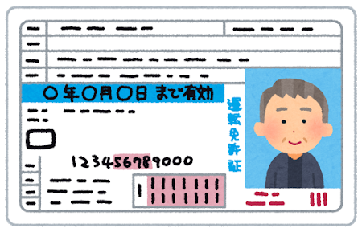

### 認証と認可の違いが度々分からなくなるからまとめ
Komori Issei

---

### 目的
- ユーザー認証を作ろうと思ったときに悩む |
- 認証と認可分からなくてモヤモヤ |
- モヤモヤを解消します。 |

---
### TL;DR
- 認証 |
  - 本人性の確認（Authentication） |
- 認可 |
  - リソースに対する利用権限の付与（Authorization） |
---
### 認証（Authentication）
- 相手が誰（何）であるか確認すること

+++

- イメージ）証明書の確認
- 純粋な認証：確認だけ

+++
#### WHAT YOU ARE（自身を提示）

+++
#### WHAT YOU HAVE（その人だけが持っているものを提示）

+++
#### WHAT YOU KNOW（その人だけが知っていることを提示）

+++

#### 認証＝APIとかリソースとか権限とか関係ない

---
### 認可（Authorization）
- とある条件に対して、リソースのアクセス権限を与えること
+++
#### イメージ）鍵の発行

+++
#### イメージ）チケットの発行

---
### 認証せずに認可は可能？
- ans）可能 |
+++
#### 誰かが購入済みのチケットを貰う＝移譲される

---
### 認証に基づく認可
- 多くの人が考える認証と認可のパターン |
- これ以外をちゃんと認識しないと、世の中の全てがこのパターンになり認識が密結合してしまう |
+++
#### 運転免許証＝本人確認＋運転の権限付与

---
### 認可に基づく認証はある？
- ans）ある |
+++
#### 車の鍵を持っている＝XXXさんである

+++
#### OAuth認証 ※OAuthは認可の仕組み
- Facebookの鍵を渡す
- Googleの鍵を渡す
- Twitterの鍵を渡す

---
### TL;DR
- 認証
  - 本人性の確認（Authentication）
- 認可
  - リソースに対する利用権限の付与（Authorization）

---
### 認証基盤はどうやって実装するのか
- AWS    : Amazon Cognito |
  - User Pools           : 認証、認可、OAuthなどもフルマネージド |
  - Federated Identities : フロント側でs3やDynamoDBを操作などSDK使用のためのアクセスキーとシークレットキーを発行 |
- GCP    : FireBase Authentications |
- Other  : Auth0 |
- Other2 : 自力で実装 |

---

https://jft2019.jaws-ug.jp/
